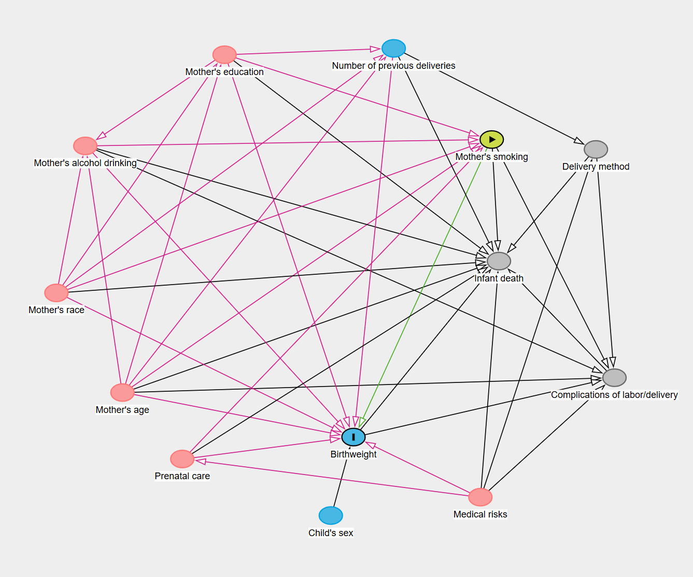
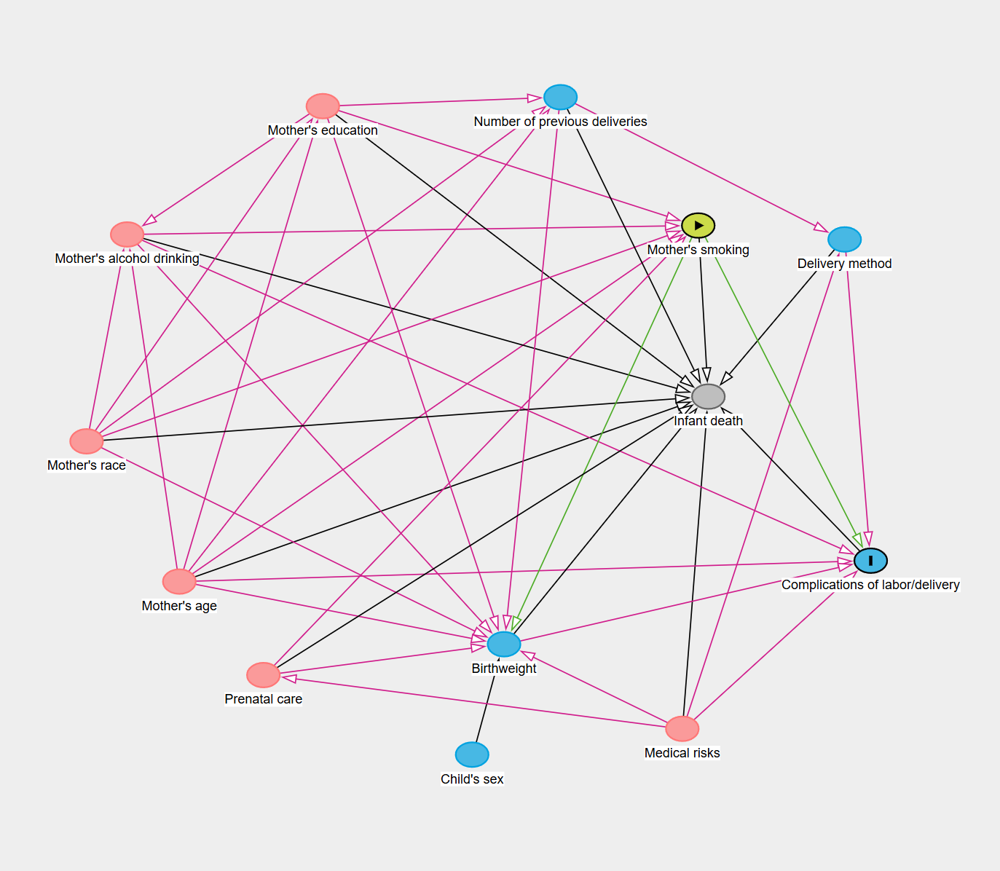

```{r setup, include=FALSE}
knitr::opts_chunk$set(
	echo = FALSE,
	message = FALSE,
	warning = FALSE
)
```

```{r}
data <- readxl::read_excel("data./HW_data.xlsx")
```

```{r}
library(psych)
library(flextable)
library(dplyr)
library(tidyverse)
library(purrr)
library(ggplot2)
library(GGally)
library(patchwork)
library(regressinator)
library(broom)
library(lmtest)
library(sandwich)
library(ggResidpanel)
library(gghighlight)
library(ggfortify)
library(gtsummary)
library(effects)
```

```{r}
my_theme <- theme(
    plot.title = element_text(size = 20, hjust = 0.5),
    axis.text.x = element_text(size = 15),
    axis.text.y = element_text(size = 15),
    axis.title.x = element_text(size = 17),
    axis.title.y = element_text(size = 17, angle = 90),
    legend.title = element_text(size = 15),
    legend.text = element_text(size = 15),
    panel.background = element_rect(fill = "white"),
    panel.grid = element_line(color = "grey90"),
    panel.border = element_rect(colour = "black", fill = NA, linewidth = 1)
  )
```

<br>

# **Постановка задачи**

Настоящее исследование направлено на количественную оценку влияния курения матери во время беременности на массу тела ребенка при рождении а также влияния курения на риск развития осложнений в родах. Определение величины эффекта по этим двум конечным точкам имеет непосредственное клиническое значение. Низкая масса при рождении, будучи суррогатным маркером, отражает комплексное негативное воздействие курения на развитие плода (ЗВУР и сопутсвующие аномалии). Параллельная оценка непосредственного риска акушерских осложнений позволит сформировать более полную картину перинатальных рисков. Полученные данные могут служить основанием для разработки клинического алгоритма ведения курящих беременных, включающего повышенную настороженность при поступлении в роддом. 

<br>

Для решения задачи будет использована каузальная, а не предсказательная модель, поскольку нас интересует не предсказание исхода (массы тела ребенка при рождении и развитие осложнений), а **оценка воздействия** (курения матери) на исход.
Предсказательная модель не позволит сделать коррекцию на конфаундеры и говорить о наличии причинной следственной связи.

<br>

Мы предполагаем, что у матерей, куривших во время беременности, младенцы имеют более низкую массу тела при рождении, а также роды будут сопряжены с большей вероятностью осложнений по сравнению с некурящими матерями.

<br>

*Снижение веса*

Существуют исследования, показавшие ассоциацию между курением матери и весом ребенка при рождении.
Так, в 1957 Simpson отметил, что новорожденные у курящих матерей (10 и больше сигарет в день) в среднем весили на 200 г меньше.
В исследовании Butler и коллег (1972) было показано, что курение матерей (в частности, на 4 месяце беременности) было связано с повышением внутриутробной и перинатальной смертности, а также снижением веса ребенка в среднем на 170 г.
Kramer провел мета-анализ исследований 1970-1984 гг.
и обнаружил, что в среднем вес детей курящих матерей оказался меньше на 149 г, а также подсчитал, что каждая выкуренная в день сигарета снижала общую массу тела ребенка при рождении на 11.1 г.

Что касается биологических причин данного явления, снижение веса можно объяснить окислительным и генотоксическим стрессом, которому подвергаются клетки плода при действии никотина и других компонентов табачного дыма, которые проходят через плацентарный барьер и задерживаются в амниотической жидкости.
Было показано, что у детей с мутациями в генах, отвечающих за защиту от окислительного стресса (ферменты системы глутатиона), снижение веса было еще больше, вплоть до 262 г (Aagaard-Tillery K, 2010).
Также, известно, что никотин вызывает сужение кровеносных сосудов (включая сосуды матки и плаценты), что ограничивает приток крови к плоду, поставку кислорода и важных питательных веществ, в то же время задерживая токсичные продукты метаболизма в тканях плода.
Монооксид углерода, поступающий в кровь при курении, имеет большее сродство к гемоглобину и образует карбоксигемоглобин, вытесняя кислород, что приводит к хронической внутриутробной гипоксии (кислородному голоданию).

<br>

*Осложнения во время родов*

Показано, что курение во время беременности ассоциировано с такими осложнениями, как предлежание плаценты, отслойка плаценты, преждевременный разрыв плодных оболочек, задержка роста плода и синдром внезапной детской смерти (Robert L. Andres, 2000).
Причины осложнений у курящих женщин могут включать множество факторов, таких как кислородное голодание тканей матки, плаценты и плода и недостаток питательных веществ (описано выше), пониженное количество коллагена 3 типа (Hadley C, 1990), воспаление плаценты и пуповины (Naeye R, 1978), подверженность бактериальным и вирусным инфекциям (снижение иммунного статуса), в целом вызванных токсическим действием никотина, продуктов его обмена (котинин), и других компонентов табачного дыма.
    
<br>

# **Материалы и методы**

## **Дизайн исследования**

Это кросс-секционное исследование. Его участниками выступили пары «мать-новорожденный», данные о которых были собраны из регистра в X году в городе N. Информация о статусе курения и других ковариатах, таких как возраст матери, уровень образования и акушерский анамнез, была получена из медицинской документации на момент родов.

<br>

## **Конечные точки**

Конечная точка №1: вес ребенка при рождении
<br>
Конечная точка №2: наличие осложнения во время родов

<br>

## **Описательные статистики**

Количественные данные будут представлены в виде среднего значения со стандартным отклонением в скобках (M (SD = x)).
Качественные данные описаны с использованием абсолютных значений и процентов (n, %).

<br>

## **Анализ конечной точки 1**

### **Описание модели**

Для оценки связи между курением матери и весом ребенка при рождении в качестве метода анализа будет использована многофакторная линейная регрессия.
Вес при рождении (в граммах) будет выступать в роли непрерывной зависимой переменной, а статус курения матери - в роли основного независимого фактора.

Поскольку на связь «курение - вес при рождении» могут влиять сторонние факторы, для получения несмещенной оценки необходимо включение в модель соответствующих ковариат.
Чтобы системно подойти к выбору этих ковариат и избежать избыточного контроля или, наоборот, упущения важных переменных, будет использован ориентированный ациклический граф (DAG).
На его основе будет определен минимально достаточный набор ковариат, необходимых для учёта смещения.
...

<br>

### **DAG и отбор ковариат для модели**



**Деление переменных:**

-   Воздействие - *Mothers smoking*
-   Исход - *Birth weight*
-   Конфаундеры - *Mothers education, Mothers alcohol drinking, Mothers race, Mothers Age, prenatal care и medical risks*, который не является прямым предком воздействия а реализует свой путь через *prenatal care*.
-   Прокси-конфаундер - *Number of previous deliveries*
-   Коллайдеры - *Infant death и Complications of labor/delivery*
-   Медиаторы - нет
-   Нейтральные переменные - *Childs sex, delivery method*

**Итоговый набор для деконфаудинга:** *Mothers education, Mothers alcohol drinking, Mothers race, Mothers Age, prenatal care*

**Примечания:** Можно было включить в модель и *medical risks*, но контролируя *prenatal care* мы тем самым блокируем и back-door путь для *medical risks* (возможно поэтому DAGitty в своём наборе его и не предлагает).
Можно было также сконтролировать переменные (*Childs sex, delivery method, number of previous deliveries*), которые не зависимо от того, учитываются ли они в модели или нет, они не открывают и не закрывают никаких back-door путей, так как они все являются предшественниками исхода их контролирование может снижать вариацию остатков модели =\> уменьшая тем самым стандартную ошибку и повышая точность оценки.
Мы их, тем не менее, решили не включать, чтобы не повышать количество переменных в модели и не столкнуться с усилением смещения

<br>

### **Измерение ключевых показателей**

В модель включены 6 показателей: *Mothers smoking, Mothers education, Mothers alcohol drinking, Mothers race, Mothers Age, Adequacy of prenatal care*.

**Исход** - *Birth weight* - количественная переменная, измеряется в граммах, что позволит оценить, на сколько граммов изменяется вес при рождении в зависимости от воздействия.

**Основной показатель (воздействие)** - *Mothers smoking* - будет измеряться количественно - среднее количество сигарет в день.
Категоризация для создания подгупп по курению исключена из-за сложности с выбором количественных порогов.
Наша задача - оценить зависимость доза-эффект.
Категоризация неизбежно приведет к потере информации и разделению двух людей возле порогового значения на две подгруппы, что внесет неточность в результаты статистических тестов.
Количественный подход сохраняет все вариации внутри группы курящих, что может увеличить статистическую мощность для обнаружения истинного эффекта.

*Mothers alcohol drinking* - аналогично с курением, прием матерью алкоголя будет измеряться в количестве дринков в день.

*Mothers Age* - переменная будет включена в модель в непрерывном виде (без категоризации).
Такой подход повышает точность оценки эффекта курения за счёт снижения стандартной ошибки регрессии.

*Mothers education* - будет учитываться как категориальная переменная, а не количественная (лет образования) из-за сложности интерпетации.
Категории образования (Elementary school, High school, Colledge) имеют универсальные понятные пороги и более точно отражают социально-экономический статус и связанные с ним поведенческие паттерны, чем простое количество лет обучения.

*Mothers race* - категориальная переменная, включает три категории (White, Black, Other).
Нам не известно, кто входит в категорию Other и мы не можем объединить ее с White или Black.

*Adequacy of prenatal care* - категориальная переменная, включает три категории (Adequate, Intermediate, Inadequate).
Недостаточно информации для объединения каких-либо из этих категорий.

Для верификации ключевых допущений линейной регрессии будет проведена диагностика модели.
Для верификации линейности связи между предикторами и исходом, а также гомоскедастичности остатков будут построены графики остатков против предсказанных значений («Residuals vs Fitted») и стандартизованных остатков против предсказанных значений («Scale-Location»).
Допущение о нормальности распределения остатков будет проверено с помощью графика квантиль-квантиль (Q-Q plot) и гистограммы.
Для диагностики влиятельны значений будет оценено расстояние Кука (Cook’s distance).
Для диагностики мультиколлинеарности независимых переменных будет рассчитан коэффициент инфляции дисперсии (VIF).

<br>

### **Формат представления результатов**

Результат будет представлен в виде точечной оценки эффекта курения в отношении среднего веса ребенка и 95% доверительного интервала для нее.

<br>

## **Анализ конечной точки 2**

### **Описание модели**

Для оценки связи между курением матери и наличием осложений в родах в качестве метода анализа будет использована многофакторная логистическая регрессия. Наличие осложения в родах будет выступать в роли бинарной зависимой переменной, а статус курения матери - в роли основного независимого фактора.

В этом случае на связь «курение - наличие осложнений в родах» так же могут влиять сторонние факторы, для детекции которых будет использован ориентированный ациклический граф (DAG).

<br>

### **DAG и отбор ковариат для модели**



**Деление переменных:**

-   Воздействие - *Mothers smoking*
-   Исход - *Complications of labor/delivery*
-   Конфаундеры - *Mothers education, Mothers alcohol drinking, Mothers race, Mothers Age, prenatal care, medical risks*, который не является прямым предком воздействия а реализует свой путь через *prenatal care*.
-   Коллайдеры - *Infant death*
-   Медиаторы - *Birth weight*\
-   Нейтральные переменные - *Childs sex, delivery method, number of previous deliveries*

**Итоговый набор для деконфаудинга:** *Mothers education, Mothers alcohol drinking, Mothers race, Mothers Age, prenatal care*

**Примечания:** Здесь, в целом, похожая ситуация, но можно было еще сконтролировать *Childs sex*, который, хоть не является прямым предком исхода, но его кнтроль будет иметь аналогичный эффект как и для предыдущей ситуцаии, потому что он все равно реализует свое воздействие на исход через медиатор =\> его включение может снижать вариацию остатков модели =\> уменьшать стандартную ошибку и повышать точность оценки.
Мы его тоже решили не включать, чтобы не повышать количество переменных в модели.

<br>

### **Измерение ключевых показателей**

В модель включены 6 показателей: *Mothers smoking, Mothers education, Mothers alcohol drinking, Mothers race, Mothers Age, Adequacy of prenatal care*.

Исход - *Complications of labor/delivery* - категориальная переменная (0 - нет, 1 - да).

Остальные показатели будут измерены аналогично предыдущей части.

<br>

# **Результаты**

## **Описательная статистика и эксплораторный анализ**

В таблице 1 представлена описательная статистика количественных переменных в формате среднее арифметическое со стандартным отклонением (Mean (SD)). Категориальные переменные описаны с использованием абсолютных чисел и долей (n, %) и представлены в таблице 2.

```{r}
data$dlivord <- as.numeric(data$dlivord)
Cont_table <- data %>%
  select("dmage", "dtotord", "dlivord", "monpre", "cigar", "drink", 
                      "nprevist", "gestat", "dbirwt") %>% 
  tbl_summary(
      label = list(
      cigar = "Среднее количество сигарет в день", 
      dmage = "Возраст матери",
      dbirwt = "Вес плода при рождении, г",
      drink = "Среднее количество дринков в день",
      dtotord = "Общий паритет",
      dlivord = "Очередность живорождения",
      monpre = "Срок беременности при постановке на учёт",
      nprevist = "Число дородовых посещений",
      gestat = "Гестационный срок на момент родов, недели"
    ),
    type = everything() ~ "continuous",
    statistic = c(all_continuous() ~"{mean} ({sd})"),
    digits = c(all_continuous() ~ c(2,2))
    ) %>% 
  modify_header(label ~ "**Переменные**") %>%
  modify_caption("**Таблица 1. Описательная статистика количественных переменных**")

Cont_table
```

```{r}
Cat_table <- data %>%
  select("mrace3", "adequacy", "medrisk", "dmeduc3", "labor") %>% 
  tbl_summary(
      label = list(
      mrace3 = "Раса", 
      adequacy = "Адекватность наблюдения",
      medrisk = "Медицинские факторы риска",
      dmeduc3 = "Образование",
      labor = "Осложнения в родах"
    ),
    type = everything() ~ "categorical",
    statistic = c(all_categorical() ~ "{n} ({p})"),
    digits = c(all_categorical() ~ c(1,1))
    ) %>% 
 modify_header(label ~ "**Переменные**")%>%
 modify_caption("**Таблица 2. Описательная статистика качественных переменных**")

Cat_table
```

В исследовании приняло участие 537 матерей.
Средний возраст матери составил 26,32 (SD = 5,77) лет.
Большинство женщин имела европеоидную расу (76%).
Что касается образования, 37,8 % участниц окончили колледж, 56,8% - High School и лишь 5,4% - Elementary School.
Среднее количество выкуриваемых сиграет в день составило 2.42 (SD = 5,91) сигареты.
Среднее количество потребляемого алкогол составило 0,03 (SD = 0,34) дринков в день.
Осложнения в родах перенесли 32,8% женщин.

<br>

### Гистограммы для количественных переменных (распределение)

Наблюдаем, что значения по ключевым показателям (паритет, курение, алкоголь) в основном сконцентрированы на нижней границе их возможного диапазона, образуя «длинный хвост» в сторону более высоких значений. Эта особенность, обусловленная критериями отбора в выборку. Она свидетельствует о высокой доле респондентов с минимальными значениями признака: обязательное наличие родов в анамнезе и массовый отказ от курения и алкоголя в гестационный период. 

```{r, fig.width=15, fig.height=10}
data_long <- data %>%
  select(dmage, dtotord, cigar, drink, dbirwt, dlivord, monpre, nprevist, gestat) %>%
  pivot_longer(cols = everything(), 
               names_to = "variable", 
               values_to = "value")

ggplot(data_long, aes(x = value)) +
  geom_histogram(bins = 30, fill = "steelblue", alpha = 0.7) +
  facet_wrap(~ variable, scales = "free", ncol = 3,
             labeller = labeller(variable = 
                                   c(cigar = "Среднее количество сигарет в день", 
                                     dmage = "Возраст матери",
                                     dbirwt = "Вес плода при рождении, г",
                                     drink = "Среднее количество дринков в день",
                                     dtotord = "Общий паритет",
                                     dlivord = "Очередность живорождения",
                                     monpre = "Срок беременности при постановке на учёт",
                                     nprevist = "Число дородовых посещений",
                                     gestat = "Гестационный срок на момент родов, недели")))+
  labs(title = "Распределение количественных переменных",
       x = "Значение",
       y = "Частота")+
  my_theme + 
  theme(strip.text = element_text(size = 13)) 

```

#### Парные корреляции между количественными переменными

Для оценки связи параметров были построены корреляционные матрицы с использованием коэффициента корреляции Спирмана.
Итоговые таблицы представлены ниже.

```{r fig.height=12, fig.width=12}
quantitative_data <- data %>% select(dmage, dtotord, cigar, drink, dbirwt)

ggpairs(quantitative_data,
        columnLabels = c(
          "Возраст матери",
          "Общий паритет",
          "Кол-во сигарет в день",
          "Кол-во дринков в день",
          "Вес при рождении, г"
        ),
  title = "Матрица графиков количественных переменных"
)
```
<br>

### Эффекты курения

На рисунке ниже представлены графики, иллюстрирующие взаимосвязь курения матери с исходами беременности. На рис. А показана зависимость между средним количеством выкуриваемых сигарет в день и массой тела ребёнка при рождении, из-за ассиметричного распределения с большим количеством нулевых значений, сложно визуально оценить тренд тенденции между количеством сигарет и массой тела при рождении. На рис. Б показана доля осложнений в родах у курящих и некурящих матерей, визуальных различий в частоте осложнений между группами не наблюдается.

```{r, fig.width=23, fig.height=8}
fig_a <- ggplot(data, aes(x = cigar, y = dbirwt)) +
  geom_point(fill = "lightblue") +
  theme_minimal() +
  labs(
    title = "Масса тела плода при рождении у некурящих и курящих матерей",
    x = "Курение, кол-во сигарет в день",
    y = "Масса тела плода при рождении, г"
  )+
  my_theme

fig_b <-ggplot(data, aes(x = labor, fill = tobacco)) +
  geom_bar(aes(y = after_stat(count / sum(count))), 
           position = "fill", alpha = 0.7) +
  scale_y_continuous(labels = scales::percent) +
  theme_minimal() +
  labs(
    title = "Осложнения в родах у некурящих и курящих матерей",
    x = "Осложнения 0-нет, 1-да",
    y = "Процент курящих и некурящих, %"
  )+
  my_theme

(fig_a|fig_b) +
  plot_annotation(
    tag_levels = 'A') &
  theme(
    plot.tag = element_text(size = 20, face = "bold"))
```

<br>

## **Результаты анализа конечной точки 1**

### Спецификация финальной модели

Для анализа зависимости массы плода от курения матери были построены линейные регрессионные модели со следующей спецификацией:

**Базовая модель:**<br> dbirwt \~ cigar

```{r}
weight_fit <- lm(dbirwt ~ cigar, data) 
```

**Полная модель с конфаундерами:**<br> dbirwt \~ cigar + drink + dmage + dmeduc3 + mrace3 + adequacy

```{r}
weight_corr_fit <- lm(dbirwt ~ cigar + dmage + mrace3 + drink + dmeduc3 + adequacy, data) 
```

### Проверка допущений

При анализе модели без поправки на конфаундеры на графике остатков от предсказанных значений (Рисунок 1.А, Приложение 1) существенных нарушений допущения о линейной зависимости выявлено не было.
Однако визуальная оценка распределения остатков, похожая на форму «расширяющегося рукава» позволяет предположить возможное наличие гетероскедастичности, что наблюдалось так же на графике Scale-Location (Рисунок 2.А, Приложение 1).
Аналогичный график для модели, скорректированной на конфаундеры (Рисунок 1.B, Приложение 1), также не демонстрирует систематических нелинейных паттернов.
Однако анализ графика Scale-Location (Рисунок 2.B, Приложение 1) выявил признаки гетероскедастичности - дисперсия остатков демонстрирует тенденцию к увеличению с ростом предсказанных значений.
Нарушение допущения о гомоскедастичности приводит к тому, что оценки их стандартных ошибок коэффициентов становятся некорректными, что делает ненадежными результаты статистических тестов.

Диагностика нормальности остатков показала, что остаточные значения в основном соответствуют нормальному распределению в обоих моделях, что подтверждается графиком Q-Q, где основная масса точек ложится на теоретическую прямую.
Наблюдаемые отклонения в хвостах распределения и небольшой левосторонний перекос на гистограмме, вероятно, обусловлены наличием выбросов (Рисунок 3.A, B).

При диагностике влиятельных наблюдений по расстоянию Кука в модели с поправкой на конфаундеры были выявлены несколько точек (наблюдения 3, 330, 279, 262) (Рисунок 4.B), значения которых заметно превышают остальные.
Это указывает на их потенциально непропорционально сильное влияние на оценки параметров модели.

```{r}
cooks_d <- cooks.distance(weight_corr_fit)
cooks_sorted <- sort(cooks_d, decreasing = TRUE)
cooks_sorted %>% head()
```

Диагностика мультиколлинеарности с помощью коэффициента инфляции дисперсии (VIF) не выявила корреляции между предикторами.

```{r}
car::vif(weight_corr_fit)
```

Обнаруженные признаки гетероскедастичности в сочетании с наличием влиятельных наблюдений обусловили необходимость коррекции модели.

Были удалены наблюдения с экстремально высокими значениями расстояния Кука (3, 330, 279, 262), чтобы повысить устойчивость оценок параметров модели.

```{r}
outliers <- c(3, 330, 279, 262)
data_corr <- data[-outliers, ]
weight_corr_fit_fin <- lm(dbirwt ~ cigar + drink + dmage + dmeduc3 + mrace3 + adequacy, data_corr) 
```

Была применена коррекция на гетероскедастичность с использованием робастных стандартных ошибок (тип HC3 в функции coeftest) для получения состоятельных оценок стандартных ошибок коэффициентов.

```{r}
weight_corr_fit_fin <- coeftest(weight_corr_fit, vcov. = vcovHC, type = "HC3")
weight_fit_fin <- coeftest(weight_fit, vcov. = vcovHC, type = "HC3")
```


### Результаты оценки

**Для модели без деконфаудинга**

```{r}
result <- broom::tidy(weight_fit_fin, conf.int = TRUE) %>%
  filter(term == "cigar") %>%
  select(term, estimate, conf.low, conf.high) %>%
  mutate(
    term = "Курение матери",
    across(c(estimate, conf.low, conf.high), ~round(., 2))
  )
result
```
**Для модели с деконфаудингом**

```{r}
result_corr <- broom::tidy(weight_corr_fit_fin, conf.int = TRUE) %>%
  filter(term == "cigar") %>%
  select(term, estimate, conf.low, conf.high) %>%
  mutate(
    term = "Курение матери",
    across(c(estimate, conf.low, conf.high), ~round(., 2))
  )
result_corr
```

В модели без коррекции на конфаундеры коэффициент регрессии -15.27, это указывает на то, что при увеличении кол-ва выкуриваемых сигарет в день на единицу в среднем ожидается снижение массы плода при рождении на 15.27 г. В модели с коррекцией на конфаундеры коэффициент регрессии -13.55, т.е., при увеличении кол-ва выкуриваемых сигарет в день на единицу в среднем ожидается снижение массы плода при рождении на 13.55 г. Обе модели показывают статистически значимую отрицательную связь между количеством выкуриваемых сигарет и весом плода при рождении. В модели без коррекции на конфаундеры каждая дополнительная сигарета ассоциирована со снижением веса в среднем на 15.27 г, а после учета смешивающих факторов эта оценка несколько уменьшается до 13.55 г. Это указывает на умеренное смещение в модели без коррекции, часть эффекта которой была обусловлена конфаундерами. Однако коррекция не меняет качественный вывод. 

### **Дополнительный вопрос исследователя - проверка эффектов пересечения**

Чтобы проверить, зависит ли полный каузальный эффект курения на средний вес ребенка от расы материа, а также от ее возраста, в базовую модель было добавлено взаимодействие между курением и этнической принадлежностью (cigar \* mrace3) и между курением и возрастом (cigar \* dmage).

```{r}
# Модель без взаимодействий
lm_base <- lm(dbirwt ~ cigar + dmage + mrace3 + drink + dmeduc3 + adequacy, data) 
```

### Для этноса

```{r}
lm_race <- lm(dbirwt ~ cigar*mrace3 + drink + dmage + dmeduc3 + adequacy, data) 
```

```{r}
result_1 <- broom::tidy(lm_base, conf.int = TRUE) %>%
  filter(term == "cigar") %>%
  select(term, estimate, conf.low, conf.high) %>%
  mutate(
    across(c(estimate, conf.low, conf.high), ~round(., 2))
  )

result_2 <- broom::tidy(lm_race, conf.int = TRUE) %>%
  filter(term %in% c("cigar", "cigar:mrace3Other", "cigar:mrace3White")) %>%
  select(term, estimate, conf.low, conf.high) %>%
  mutate(
    across(c(estimate, conf.low, conf.high), ~round(., 2))
  )

result_1
result_2
```
В модели, предполагающей однородное влияние курения на вес при рождении независимо от расовой принадлежности матери, потребление каждой дополнительной сигареты в день в среднем ассоциировано со снижением веса новорожденного на 13.55 грамм.
<br>
При учете потенциального эффекта модификации влияния расы, наблюдаются различия в ассоциации между курением и весом при рождении в зависимости от расовой принадлежности. В референтной группе (чернокожие женщины) каждая дополнительная сигарета ассоциирована со снижением веса на 9.24 грамма. Для женщин европеоидной расы влияние курения оказывается более выраженным: по сравнению с чернокожими женщинами, каждая сигарета ассоциирована с дополнительным снижением веса на 5.92 грамма. Таким образом, совокупный эффект курения в этой группе составляет -15.16 грамм на сигарету. В группе "другие расы" наблюдается ослабление негативного влияния курения: по сравнению с чернокожими женщинами, эффект курения на 10.05 грамм менее выражен, что соответствует практически нулевому общему влиянию (+0.81 грамм на сигарету). 
<br>
Результаты указывают на гетерогенность влияния курения матери на вес при рождении в зависимости от расовой принадлежности. Наиболее выраженная негативная ассоциация наблюдается среди женщин европеоидной расы, в то время как в группе "другие расы" влияния курения не выявлено.

```{r}
anova(lm_base, lm_race)
```
Overall p-value: Pr(>F) = 0.719.
Следует отметить, что P-value для совместного теста взаимодействий (cigar:mrace3) равен 0.719. Это выше порога значимости (0.05). Таким образом, нулевую гипотезу об отсутствии взаимодействия между курением и расой отвергнуть нельзя. Поскольку взаимодействие незначимо, нет оснований полагать, что полный каузальный эффект курения на вес ребенка систематически различается между расами в модели. Поэтому данный эффект не будет включен в финальную спецификацию модели. 

### Для возраста

```{r}
lm_age <- lm(dbirwt ~ cigar*dmage + mrace3 + drink + dmeduc3 + mrace3 + adequacy, data) 
```

```{r}
result_3 <- broom::tidy(lm_base, conf.int = TRUE) %>%
  filter(term == "cigar") %>%
  select(term, estimate, conf.low, conf.high) %>%
  mutate(
    across(c(estimate, conf.low, conf.high), ~round(., 2))
  )

result_4 <- broom::tidy(lm_age, conf.int = TRUE) %>%
  filter(term %in% c("cigar", "cigar:dmage")) %>%
  select(term, estimate, conf.low, conf.high) %>%
  mutate(
    across(c(estimate, conf.low, conf.high), ~round(., 2))
  )

result_3
result_4
```
При учете потенциального эффекта взаимодействие между курением и возрастом матери, можно отметить, что с каждым дополнительным годом жизни матери влияние курения на вес при рождении изменяется в среднем на -1.18 г на каждую выкуренную сигарету.

```{r}
anova(lm_base, lm_age)
```

Overall p-value: Pr(>F) = 0.1331.
P-value для теста взаимодействия cigar:dmage равен 0.1331. Оно превышает порог значимости 0.05. Следовательно, в данном случае, у нас также нет достаточных оснований отвергнуть нулевую гипотезу об отсутствии взаимодействия между курением и возрастом. И данное взаимодействие тоже не будет включено в финальную спецификацию модели.


## **Результаты анализа конечной точки 2**

### Спецификация финальной модели

Для анализа зависимости наличия осложнения при родах от курения матери были построены логистические регрессионные модели со следующей спецификацией:

**Базовая модель:**<br>  labor ~ cigar

```{r}
data <- data %>% mutate(labor = as.numeric(labor))

labor_fit <- glm(
  labor ~ cigar,
  data,
  family = binomial()
)
```

**Полная модель с конфаундерами:**<br> labor ~ cigar + drink + dmage + dmeduc3 + mrace3 + adequacy

```{r}
labor_fit_corr <- glm(
  labor ~ cigar + drink + dmage + dmeduc3 + mrace3 + adequacy,
  data,
  family = binomial()
)
```

### Проверка допущений

При анализе модели на графике частичных остатков (Рисунок 1, Приложение 2) существенных нарушений допущения о линейной зависимости выявлено не было ни для одной из количественных переменных.

При диагностике влиятельных наблюдений по расстоянию Кука в модели с поправкой на конфаундеры было выявлено наблюдения 330 (Рисунок 2.B, Приложение 2), с экстремально высоким значеним относительно остальных. Это может указывать на его потенциально непропорционально сильное влияние на оценки параметров модели.

#### Влиятельные наблюдения 

```{r}
cooks_d <- cooks.distance(labor_fit_corr)
cooks_sorted <- sort(cooks_d, decreasing = TRUE)
cooks_sorted %>% head()
```

#### Мультиколлинеарность

Диагностика мультиколлинеарности с помощью коэффициента инфляции дисперсии (VIF) не выявила корреляции между предикторами.

```{r}
car::vif(labor_fit_corr)
```
Было удалено наблюдение с экстремально высоким значением расстояния Кука (330), чтобы повысить устойчивость оценок параметров модели.

```{r}
outliers <- c(330)
data_corr <- data[-outliers, ]
labor_fit_corr_fin <- glm(
  labor ~ cigar + drink + dmage + dmeduc3 + mrace3 + adequacy,
  data_corr,
  family = binomial()
)
```

### Результаты оценки

```{r}
tbl_regression(labor_fit, exponentiate = TRUE)
```

```{r}
tbl_regression(labor_fit_corr_fin, exponentiate = TRUE)
```

Как в нескорректированной, так и в скорректированной на конфаундеры модели анализ не выявил статистически значимой связи между курением и вероятностью осложнений в родах. Отношение шансов (OR) как до, так и после коррекции составило 0.99. Доверительные интервалы в обеих моделях включали единицу (0.96, 1.02) и (0.96, 1.03) соответственно, что подтверждает отсутствие статистически значимого эффекта. Таким образом, можно отметить, что первоначально наблюдаемое отсутствие связи не было артефактом, вызванным смещением оценки из-за конфаундеров. 

<br>

# **Ограничения**

Нв связи с тем, что дизайн эксперимента является кросс-секционным мы можем ожидать следующие систематические ошибки: смещение из-за неучтенных конфаундеров - даже после построения DAG. Например, стресс может сам по себе негативно влиять и на вес ребенка при рождении и на развитие осложнений во время родов и на курение матери. Так как информация о курении собиралась со слов матерей, они могут неправильно оценивать среднее количество выкуриваемых сигарет в день или намеренно занижать их количество, так как курение во время беременности считается социально неодобряемым поведением. Это может занизить влияние курения на вес ребенка и осложнения.

<br>

# **Выводы** 

Проведённый анализ с помощью линейной регрессии выявил статистически значимую дозозависимую связь между курением матери во время беременности и снижением массы тела ребёнка при рождении. Согласно интерпретации результатов модели, каждая дополнительная сигарета, выкуриваемая в день, в среднем ассоциирована со снижением веса на 13.55 грамма.

Однако ширина 95% доверительного интервала для данного эффекта (-5.31; -21.78 г) указывает на существенную неопределённость в оценке силы этой связи в генеральной совокупности. Снижение веса варьирующееся от 5 г на сигарету (сценарий умеренного воздейтсвия) до 21 г на сигарету (сценарием выраженного воздействия), также вполне совместимо с нашими данными, с учетом сделанных нами предположений. Таким образом, при значениях, соответствующим нижней границе интервала, клинически значимое снижение веса (условно ≥200 г) могло бы наблюдаться лишь при экстремально высоком потреблении (около 40 сигарет в день). Для значений, соответвующих верхней границе интервала, для достижения клинически значимого снижения достаточно умеренного курения (около 10 сигарет в день).

Тем не менее, поскольку интервал включает значения, представляющие безусловное клиническое воздейтсвие, результаты обосновывают рекомендацию полного отказа от курения во время беременности в качестве наиболее безопасной превентивной меры. Для уточнения величины эффекта необходимы дальнейшие исследования с большей выборкой.

В то же время, анализ связи между курением матери и вероятностью осложнений в родах с помощью логистической регрессии не показал статистически значимых ассоциаций. Таким образом, в рамках нашего исследования не получено статистических и клинических свидетельств того, что курение повышает или понижает риск осложнений при родах.

<br>

# **Приложения**

## **Приложение 1: Диагностика модели влияния курения на вес при рождении**

### **Рисунок 1.A, B:** Диагностические графики базовой модели без поправки на конфаундеры (A), с поправкой на конфаундеры (B)

```{r, fig.height=4, fig.width=11}
pl1 <- autoplot(weight_fit, 1, ncol = 1)
pl1_plot <- pl1[[1]]
pl1_plot <- pl1_plot + labs(title = "Модель без деконфаудинга")

pl2 <- autoplot(weight_corr_fit, 1, ncol = 1)
pl2_plot <- pl2[[1]]
pl2_plot <- pl2_plot + labs(title = "Модель с деконфаудином")

(pl1_plot|pl2_plot) +
  plot_annotation(
    tag_levels = 'A')
```

### **Рисунок 2.A, B:** Диагностика допущении о гомогенности дисперсии остатков (гомоскедастичности) для неполной модели (A) и для полной модели, (B)

```{r, fig.height=4, fig.width=11}
pl1 <- autoplot(weight_fit, 3, ncol = 1)
pl1_plot <- pl1[[1]]
pl1_plot <- pl1_plot + labs(title = "Модель без деконфаудинга")

pl2 <- autoplot(weight_corr_fit, 3, ncol = 1)
pl2_plot <- pl2[[1]]
pl2_plot <- pl2_plot + labs(title = "Модель с деконфаудином")

(pl1_plot|pl2_plot) +
  plot_annotation(
    tag_levels = 'A')
```

### **Рисунок 3.A, B:** Диагностика допущения о нормальном распределении для неполной модели (A) и для полной модели (B)

```{r, fig.height=6, fig.width=8}
pl1 <- resid_panel(weight_fit, plots = c("qq", "hist"))

pl2 <- resid_panel(weight_corr_fit, plots = c("qq", "hist"))

(pl1/pl2)+
  plot_annotation(
    title = ("Модель без деконфаудинга (A) и с деконфаудингом (B)"),
    theme = theme(plot.title = element_text(hjust = 0.5)),
    tag_levels = 'A')

```

### **Рисунок 4.A, B:** Диагностика влиятельных наблюдений в неполной модели (A) и полной модели (B)

```{r, fig.height=6, fig.width=8}
pl1 <- resid_panel(weight_fit, plots = c("lev", "cookd"))

pl2 <- resid_panel(weight_corr_fit, plots = c("lev", "cookd"))

(pl1/pl2)+
  plot_annotation(
    title = ("Модель без деконфаудинга (A) и с деконфаудингом (B)"),
    theme = theme(plot.title = element_text(hjust = 0.5)),
    tag_levels = 'A')
```

<br>

## **Приложение 2: Диагностика модели влияния курения на осложнения в родах**

### **Рисунок 1:** Диагностические графики для оценки линейной зависимости для количесвтенных переменных.

```{r, fig.width=10, fig.height=7}

car::crPlots(labor_fit_corr, terms = ~ . - dmeduc3 - mrace3 - adequacy)

```

### **Рисунок 2.A, B:** Диагностика влиятельных наблюдений в неполной модели (A) и полной модели (B)

```{r, fig.height=6, fig.width=8}
pl3 <- resid_panel(labor_fit, plots = c("lev", "cookd"))

pl4 <- resid_panel(labor_fit_corr, plots = c("lev", "cookd"))

(pl3/pl4)+
  plot_annotation(
    title = ("Модель без деконфаудинга (A) и с деконфаудингом (B)"),
    theme = theme(plot.title = element_text(hjust = 0.5)),
    tag_levels = 'A')
```
